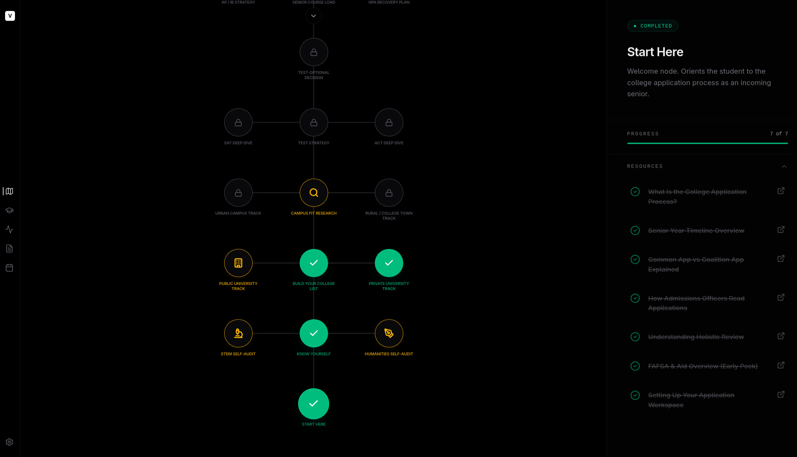
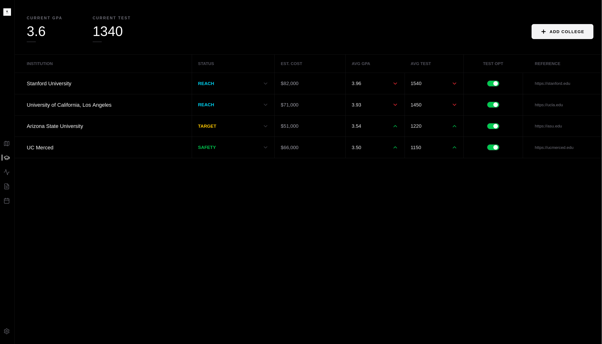
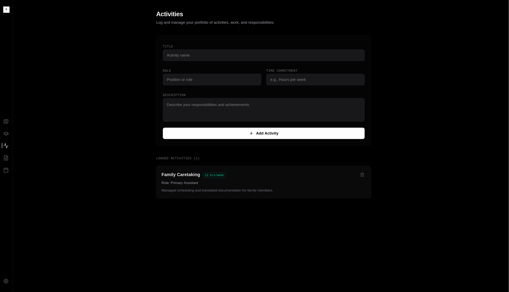
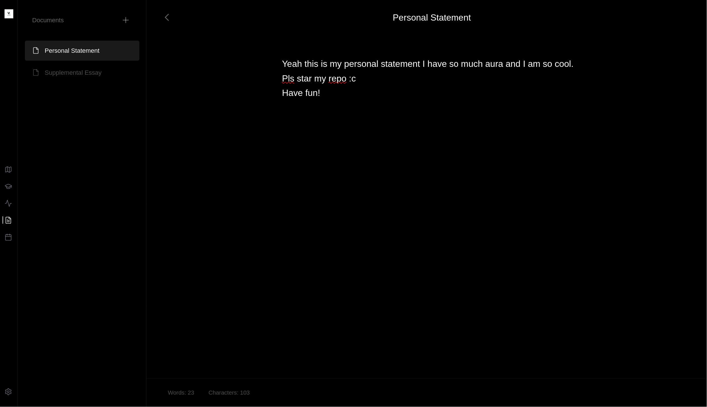

<div align="center">


# Velora

**A comprehensive college application management platform. Open source. Privacy-first. Built by students.**

[](LICENSE)
[]()

</div>

## Overview

Velora is a structured, open-source platform designed to streamline the college application workflow. Built by a student developer who recognized the fragmentation in application management tools, Velora consolidates the entire process—from self-assessment through enrollment—into a single, cohesive interface.

The platform prioritizes user privacy through client-side storage, requires no authentication, and maintains zero external dependencies for data persistence. All state is managed through browser localStorage with a versioned persistence layer.

---

## Architecture

### Technology Stack

**Frontend**

- Svelte 5 with rune-based reactivity
- Tailwind CSS for styling
- Vite as build tool
- SvelteKit for routing and server-side capabilities

**Desktop Application**

- Tauri v2 for native application wrapper
- Cross-platform support (macOS, Windows, Linux)
- Native window management and OS integration

**Storage**

- Browser localStorage (client-side only)
- JSON-based export/import for data portability
- Versioned key structure for backward compatibility

**Design**

- Responsive design supporting desktop and tablet viewports
- Mobile support planned for future releases
- Dark-first UI paradigm

---

## Core Features

### Skill Tree Pathfinder

An interactive visualization of the college application process structured as a nine-phase progression tree. Users navigate through sequential milestones from self-assessment through final enrollment decisions.

**Implementation**: SVG-based rendering with adaptive scaling, smooth panning on narrow viewports, custom scrollbar implementation.



### College List Management

Structured interface for tracking and categorizing prospective schools. Integrates with university dataset to auto-populate institutional metrics.

**Features**:

- Reach/Target/Safety classification
- Automatic tier calculation based on student metrics (GPA, test scores)
- Manual override capability
- Cost and admission requirement tracking
- Direct linking to institution websites



### Activities & Portfolio Management

Dedicated module for documenting extracurricular involvement, leadership roles, and time commitments.

**Functionality**:

- Structured activity logging with role and hours tracking
- Searchable portfolio
- Persistent storage with automatic sync



### Writing Workspace

Focused environment for college essay composition with real-time word and character counting.

**Features**:

- Multi-document support
- Document management (create, rename, delete)
- Automatic persistence
- Collapsible sidebar for distraction-free writing



### Calendar & Deadline Tracking

Visual calendar interface for managing application deadlines, test dates, and FAFSA timelines.

**Implementation**:

- Grid-based calendar rendering
- Event previews on hover
- Modal-based event creation
- Persistent deadline storage

---

### Settings & Data Management

User-facing controls for data export, import, and reset functionality.

**Capabilities**:

- JSON export for data portability
- JSON import to restore state
- Full data reset with confirmation dialog
- Version tracking for future migrations

---

## State Management

Velora uses Svelte 5 reactive runes for state management:

- `$state` for reactive data
- `$derived` for computed values
- `$effect` for side effects and persistence

### Persistence Architecture

**File**: `src/lib/persist.ts`

All data is persisted through a versioned key structure:

```
velora_v{VERSION}_{pillar}
```

Where pillar refers to each data domain: map, colleges, activities, calendar, documents.

**Store Types**:

- MapStore: Node status and resource completion tracking
- CollegesStore: Institution list with metrics
- ActivitiesStore: Activity entries
- CalendarStore: Event timestamps and titles
- DocumentsStore: Writing content with metadata

---

## Getting Started

### Prerequisites

- Node.js 18+
- pnpm (preferred) or npm

### Web Development

```bash
git clone https://github.com/get-velora/velora.git
cd velora
pnpm install
pnpm dev
```

### Desktop Application (Tauri)

Build the native desktop application:

```bash
cd src-tauri
cargo build --release
```

Outputs native binaries for the current platform.

### Production Build

```bash
pnpm build
```

---

## Project Structure

```
velora/
├── src/
│   ├── app.html              # Root HTML template
│   ├── app.css               # Global styles
│   ├── components/
│   │   ├── BgDarkTiles.svelte
│   │   ├── DataManager.svelte
│   │   ├── DetailPanel.svelte
│   │   ├── LeftBar.svelte
│   │   ├── SkillTreeCanvas.svelte
│   │   ├── Titlebar.svelte
│   │   └── WelcomeBanner.svelte
│   ├── lib/
│   │   ├── nodesData.ts       # Skill tree node definitions
│   │   ├── persist.ts         # Storage layer
│   │   ├── store.svelte.ts    # Reactive stores
│   │   ├── types.ts           # TypeScript interfaces
│   │   └── utils.ts           # Utility functions
│   └── routes/
│       ├── +layout.svelte     # Root layout
│       ├── +page.svelte       # Welcome page
│       ├── activities/
│       ├── calendar/
│       ├── colleges/
│       ├── documents/
│       ├── map/
│       └── settings/
├── src-tauri/                 # Tauri desktop application
│   ├── src/
│   │   ├── lib.rs
│   │   └── main.rs
│   └── tauri.conf.json
├── static/                    # Images and static assets
├── vite.config.js
├── svelte.config.js
├── tsconfig.json
└── package.json
```

---

## Data Model

### Node (Skill Tree)

```typescript
interface PathfinderNode {
  id: string;
  title: string;
  description: string;
  status: "completed" | "current" | "upcoming";
  level: number;
  position: "center" | "left" | "right";
  icon: SvelteComponent;
  resources: NodeResource[];
  track?: string;
}
```

### Resource

```typescript
interface NodeResource {
  id: string;
  title: string;
  description: string;
  url: string;
  type: "guide" | "article" | "official" | "tool" | "video" | "calculator";
  completed: boolean;
}
```

### College

```typescript
interface College {
  id: number;
  name: string;
  status: "Reach" | "Target" | "Safety";
  cost: string;
  avgGpa: string;
  avgTest: string;
  testOptional: boolean;
  url: string;
  isManual?: boolean;
}
```

---

## Privacy & Data Security

Velora implements privacy by design:

- No user accounts or authentication required
- No external API calls for user data
- All data stored exclusively in browser localStorage
- No cookies or tracking mechanisms
- No third-party analytics
- Source code publicly available for auditing

Data export functionality enables users to maintain portable backups in standard JSON format.

---

## Development

### Code Standards

- TypeScript for type safety
- Svelte 5 reactive runes for state management
- Tailwind CSS for styling
- Single-line comments only (no block comments)
- Meaningful commit messages

### Building Components

- Keep components focused and reusable
- Use props for data passing
- Leverage derived state for computed values
- Minimize side effects through effect boundaries

### Testing

Test changes across multiple viewports:

- Desktop (1920x1080)
- Tablet (768x1024)
- Responsive behavior on narrow screens

---

## Future Development

### Native Application Expansion

Velora is architected for Tauri integration, enabling native desktop applications with:

- Operating system integration
- Offline-first functionality
- System tray support
- File system access for direct JSON import/export
- Platform-specific enhancements

### Planned Enhancements

- Mobile-optimized interface
- Multi-language support
- Enhanced calendar views
- Advanced filtering and search
- Timeline visualization for deadlines
- Data analytics and insights

---

## Contributing

Contributions are welcome. See [CONTRIBUTING.md](CONTRIBUTING.md) for guidelines.

### Quick Start

```bash
git clone https://github.com/get-velora/velora.git
cd velora
pnpm install
pnpm dev
```

---

## License

MIT License - see [LICENSE](LICENSE) for details.

---

## Related

- [Contributing Guide](CONTRIBUTING.md)
- [GitHub Repository](https://github.com/get-velora/velora)
- [Issue Tracker](https://github.com/get-velora/velora/issues)
